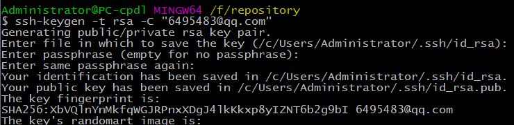

### 安装

* window版本下载地址：[msysgit-2.13](https://github.com/git-for-windows/git/releases/download/v2.13.1.windows.2/Git-2.13.1.2-64-bit.exe)
* 安装完成后，在开始菜单会添加：“Git --> Git Bash”命令。也可用 鼠标右键 出现的"Git GUI here" 和 “Git Bash here” 快捷方式。

### 本地仓库

* 创建仓库存放目录。在F:盘新建目录：`F:/git`。

* 打开命令界面。在`F:/git` 文件下，使用鼠标右键的“Git Bash here”。打开命令界面。
  

* 添加用户标识：用户名和邮箱地址。
  ```shell
  git config --global user.name "cpdl"
  git config --global user.email "6495486@qq.com"
  ```
  
  > 注意的是：这里 --global 表示这台主机其它git仓库都使用这个配置。

* 初始化**版本库**。

  ```shell
  git init
  ```

  > 创建后，会在这个目录下生成.git的目录，存放git管理版本的文件。千万不要动这个目录。

  

### 远程仓库
#### 下载远程库

* 这里以`F:/`下，新建文件夹repository作为目录。

* 任意位置，打开git命令界面。然后进入`F:/repository`。

  > 说明：git命令界面下，根目录指的是git安装的目录。window系统盘会挂载在/目录下，所以F:盘
  >
  > 进入的命令行是：`cd /f` ，F盘目录下repository目录进入命令即：`cd /f/repository`
  >
  > 另外，git支持常用命令：`cd <path>` 进入目录，`ls <file>` 列出当前目录下文件，`pwd` 显示当前路径 。`clear` 清屏。`cat <file>` 查看文本文件。

* 下载远程仓库。

  ```shell
  # git clone [path_to_repository] 克隆远程仓库命令.
  git clone https://github.com/cpdl/tornado.git
  ```

  > 下载完远程仓库后，在`F:/repository`目录下，会生成该仓库的目录和文件。

  

#### 同步远程库

* 注册[github](https://github.com)账号，这里不多做介绍。

* 创建这台主机的SSH密码。

  > 使用命令后，会生成一对密钥存放在用户家目录下的.ssh文件夹中(`C:\Users\Administrator\.ssh`)。
  >
  > id_rsa是私钥，要自行保存，不能泄露。id_rsa.pub 公钥，可放在其它服务器。

  ```shell
  # -t 指的类型， -C 备注信息 comment, 生成密钥过程中，其它按默认配置，全按enter键。
  ssh-keygen -t rsa -C "6495486@qq.com"
  ```

  

* 添加ssh keys到帐户信息中。

  * 网站的[个人信息](https://github.com/settings/keys)设置中，添加公钥信息。

    ​

    

  * 用记事本打开公钥，将公钥字符串拷贝过去。

    

* 在github中创建仓库。

  * 创建仓库。见上面图中蓝色标记。

    

  * 在返回的页面中，会给出同步远程仓库的连接步骤。在给出的两种方法任选其一。

    ```shell
    # 1： 创建一个新的仓库，并推送远程仓库。
    echo "# git" >> README.md
    git init
    git add README.md
    git commit -m "first commit"
    git remote add origin https://github.com/cpdl/git.git
    git push -u origin master

    # 2： 推送本地已存在的仓库  到 远程仓库。
    git remote add origin https://github.com/cpdl/git.git
    git push -u origin master
    ```
* 连接关连远程仓库。
    > 我们这里以上一节中，下载的仓库为例。
    >
    > 因为是从远程下载的仓库，带有远程的源仓库。这里需要先删除源。再查看源。最后使用上面的方法2，添加本地仓库到新建的仓库中。第一次连接上传，需要提供你的git用户和密码验证。

    ```shell
    git remote remove origin							  #删除原仓库的源
    git remote -v										 #查看仓库源
    git remote add origin https://github.com/cpdl/git.git	#添加远程源仓库
    git push -u origin master							  #推送仓库
    ```

    


### GIT本地仓库操作

#### 工作区域

* git将本地文件存放区间分为三个部分：工作区，暂存区，版本库。

  > git软件是一个分布式的版本控制系统。版本控制指的是 文件 修改后，存档记录，每一个存档都是一条记录。以便于查看文件的变化，和返回之前的存档。
  >
  > 工作区：本地仓库目录下。可以新建文件，修改文件，删除文件。
  >
  > 暂存区：本地仓库的版本库中，尚未写入版本管理中。
  >
  > 版本库：本地仓库的版本库中，一条存档记录。
  >
  > 举例：我们在网上购物。可以随意浏览物品，此时相当于我们**处于工作区**。想要购买某个物品时，把物品加入购物车，此时相当于我们把文件**放入暂存区**。确定购买时，在购物车中结帐付款，此时相当于提交文件到版本库，做**版本记录**。

####文件添加

*  查看文件状态

  > `git status <file>` 查看文件状态。如果没有指定文件名，表示查看本地仓库所有文件的状态。
  >
  > 我们以`F:/git` 本地仓库为例，来创建文件。注意使用命令查看 **文件状态信息**。


* 工作区编写文件。和我们平常操作文件一样，新建，编写保存，删除等。文件状态：**untracked files**

    

* 将文件 从工作区 提交 到暂存区。文件状态：**changes to be committed**

    > 这里注意的是：将暂存区的文件信息删除的命令：`git rm --cached <file>` 。
    >
    > 注意换行符，在windows下为CRLF,在linux下为LF。这里已经帮你转换过。
    ```shell
    # 命令： git add <file> .多个文件 ：可用路径加点的方式代替。如static目录下：git add static/.
    git add new.txt
    ```

    

  * 将文件 从 暂存区 提交 到版本库。

    > 查看版本命令：`git log` .
    >
    > 注意：文件 从暂存区提交到版本库。如果从工作区提交到版本库中 `git commit -a -m "from work tree"`，强烈不建议这么做。

    ```shell
    #命令：git commit -m "备注信息"
    git commit -m "添加new.txt"
    ```

    

#### 文件修改

* 我们只能在工作区，对文件进行编辑。

* 文件在工作区时，尚未提交到暂存区时。我们可以对文档进行任意修改。

* 文件已提交到暂存区。在工作区，我们重新编辑文件。文件会出现差异。提交到版本库，以暂存区为准。

  > 文本文件比较：`git diff <file>` ，这里比较的是：工作区 和 暂存区的差异。
  >
  > 这时如果提交到版本库。文件在暂存区**不会清除**。
  >
  > 此外：文件在工作区和暂存区不同时，我们有以下命令可以处理这种情况。
  >
  > `git rm --cached <file>` 删除暂存区的文件。相当于保存了工作区的修改。
  >
  > `git checkout -- <file>` ,将文件从暂存区中取回到工作区。相当于保存了暂存区的修改，工作区修改作废。并且清除暂存区该文件。
  >
  > `git  add  <file>` , 将文件重新从工作区提交到暂存区。

  

  > 此时编辑文件hello.txt，追加 `Are you OK?`

  

* 文件在最近一次版本中有记录。然后在工作区中编辑。查看此时工作区做出的修改信息：

  > 这里补充下：`HEAD` 默认的当前版本标识,如果后跟`HEAD^` 表示上个版本。`--` 表示工作区

  ```shell
  git diff HEAD -- <file>			#工作区和当前版本文件对比
  git diff HEAD^ HEAD <file>		#当前版本和上个版本文件对比
  ```

  


#### 文件删除

* 直接删除 工作区的文件，不会对暂存区和版本库有影响。

  ```shell
  # 可在git的命令界面下输入：
  rm aa.txt
  ```

* 删除 暂存区的文件，不能再进行提交到版本库（最好从暂存区提交到版本库，生成新的版本记录）。

  ```shell
  # 注意这里--cached 是参数，不要和-- 工作区弄混。
  git rm --cached aa.txt
  ```

* 版本记录中的文件：先删除 工作区的文件，再提交到暂存区，最后提交到版本库，重新生成新的版本记录。(注意的是，以前的版本，仍有该文件。)

  

#### 文件操作总结

* 文件状态和文件操作：

  

* 文件对比：

  

* 撤消文件：

  

#### 仓库操作

* 添加远程仓库： `git remote add origin <path_to_repository>`
* 把本地仓库推送远程仓库： `git push -u origin master <path_to_repository>` . `-f` 强制推送
* 从远程仓库拉取到本地仓库：`git pull origin master <path_to_repository>`
* 查看远程源仓库：`git remote -v`
  * 删除远程仓库：`git remote remove origin `
  * 远程仓库重命名：`git remote rename repository_name  new_repository_name`

### 版本回退

#### 版本查看

* 显示详细的版本信息：`git log` ，会打印出所有版本记录详细信息。

* 每条版本信息打印一行，`git log --pretty=oneline` ,这对于经常进行版本提交，很有帮助。

* 这里提醒一点，每一次提交时，一定要添加备注信息标明这次提交的内容。

  

#### 版本跳转

* 根据版本号进行版本回退跳转工作。命令：`git reset --hard <版本号>` ，这里版本可以从头开始写一部分，但是尽量不能让写出的版本号有重复。 例如：`git reset --hard 8fa7f` 

* 版本跳转，参数 `HEAD` 指的是当前版本，不论本地仓库怎么跳转，它总是当前仓库的版本号。这里`--hard` 指的是版本结点。当版本回退后，当前的`HEAD`会指向指定的版本号。

  

* 假如 `hard 2` 版本结点记录的ID是8fa7f ，当我们使用 `git reset --hard 8fa7f`后，此时查看版本库信息，就只会显示`hard 2` 之前的版本号。如果我们不知道5的结点信息，那么就不能再返回结点5.

* 这里，git为我们提供了一个命令：`git reflog` 查看所有`HEAD` 曾经指向过的结点信息.

  

  ​

