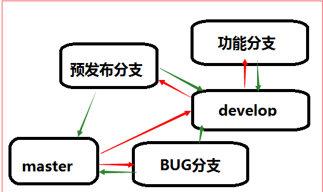
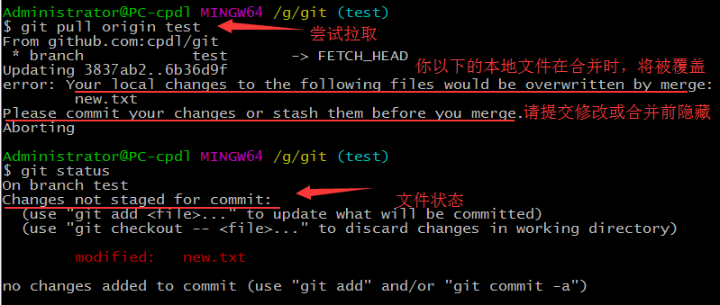
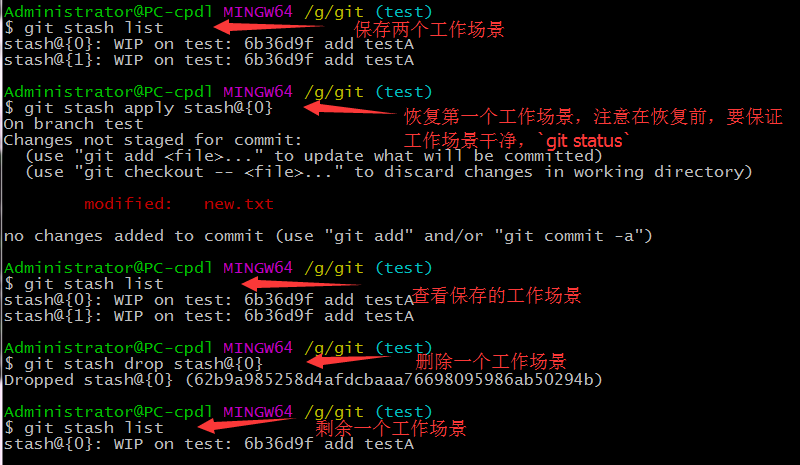

### 分支

#### 分支概念

* 在上节中，我们主要是在本地仓库中操作版本提交并上传远程仓库。每一次提交，git 都会把它们串成一条时间线。这一条线，在主仓库中，称为主干 ，也称master分支。此前，HEAD 严格来说，不是指向提交的版本，而是指向master分支，而master分支才指向提交版本。如下图所示：


* 而在实际环境中，会有许多人对同一个项目的代码进行编写。但，又不能让多人同时对同一个文件进行不同的修改提交。这里引入了分支的概念。可以想想成一棵大树，有主干，有分支，分支基于主干分出，互不影响。不同的是，在git中，分支可以合并入主干中。大致的样子是这样：

  

  > 分支，相当于从主分支master中,拷贝所有文件的副本到别一个文件DEV。然后切换目录到DEV中，编写的文件都在DEV中进行。
  >
  > 当主分支处于版本2时，为解决一问题分出一个分支B( HEAD 指向DEV)。主分支由其它人继续编写，当我们解决完问题后，需要将分支编写的问题，合并到主干上。此时，HEAD 将分支内容提交主干，并重新指向Master分支。

#### 分支操作

* 查看分支：`git branch`

* 创建分支：`git branch <branch_name>` 。 这里创建bug1024 分支：`git branch bug1024`

* 切换分支：`git checkout <branch_name>` 。切换HEAD到 bug1024上：`git checkout bug1024`

* 创建+切换分支： `git checkout -b <branch_name>`

  

  

* 同样，我们可以在分支上，再建分支。

#### 分支合并

* 合并某分支到当前分支：`git merge <branch_name>`

* 删除分支:`git branch -d <branch_name>`. 

* 这里需要注意的是：你当前所处于的分支。使用`git branch` 命令，星号显示你处于的分支。

  > 以图片二为例，合并分支，需要先切换到master分支，再合并DEV分支。
  >
  > 合并后，分支DEV不再存在。之前的分支信息保留，没有删除分支信息。

#### 分支冲突

* 分支的合并

  > 这里，我们要提到一个“**包含**” 的概念。两个分支，如果合并成功。必然是两个分支下的同一个文件内容，被另一个分支下的文件内容所"包含"。
  >
  > 如下图所示：master文件A，被分支文件A+ 所包含。合并后的文件，会以A+ 为准。
  >
  > 

* 分支冲突

  > 不同的分支，是由不同的人员维护。
  >
  > 当不同分支人员，在没有合并分支前，对分支相同的文件，进行不同的修改时。
  >
  > 在合并分支时，由于文件 ，不能被 “包含”，那合并后的文件，该以谁的为准 呢？
  >
  > 产生的这种冲突，就是分支冲突。
  >
  > 解决分支的方法，很简单，将其中一个分支的文件，修改成能被另一个分支的文件所"包含"。

* 分支冲突演示：

  > 两个分支：master和 bug1024. 对同一个文件：new.txt进行修改。
  >
  > 主分支修改：
  >
  > 
  >
  >   
  >
  > bug1024 分支 修改情况：
  >
  > 
  >
  >   
  >
  > 版本合并情况：
  >
  > 
  >
  > 
  >
  >   
  >
  > 解决冲突：
  >
  > 

* 总结分支冲突问题

  > 分支冲突：由于 不同的分支 对同一文件，进行修改后，在合并时，导致文件不能“包含”，进而合并失败。
  >
  > 解决办法：
  >
  > 1. 取消合并，`git merge --abort`.
  > 2. 修改冲突文件，并重新提交版本库。

#### 分支管理策略

#####　分支信息管理。

> 通常合并分支，默认的使用`Fast forward` 模式。这种模式，在删除分支后，分支信息会丢弃。
>
> 
>
> 
>
> 我们可用参数 `-no-ff` 表示禁用 `fast forward`模式。 
>
> 这样在删除分支后，会保留删除的分支信息。以便于在以后查看。
>
> 

####　分支策略

* 主分支

  > 一般情况下, master 应该保持稳定，用来发布新版本。尽量不要在上面干活。
  >
  > 如果有需求，在新建分支上做。做完后，可以合并到主分支master上.

* 其它分支信息

  > 开发分支 develop        日常开发，和主分支合并，生成最新代码版本。
  >
  > 功能分支 feature          开发功能，develop分出来，开发完，并入develop.
  >
  > 预发布分支  release      测试版本，develop分出来，预发布结束，须合并进develop和master分支。
  >
  > bug 分支 fixbug            bug修补，从master分出来，修补结束，须合并进master和develop分支。
  >
  > 其它分支 other
  >
  > ​
  >
  > 

### 实用场景

#### 查看远程分支

* 远程分支

  ```shell
  git branch		#分支信息
  git remote -v	#远程信息
  ```

  > 需要注意的是：当你抓取和推送远程 origin （源）信息时，实际上 git 自动把本地的 master 分支 和 远程master 分支 对应 ，远程仓库 默认名称是 origin.
  >
  > 


#### 创建远程分支

* 创建远程分支

  * `git branch` 参数信息

    > `git branch ` : 列出本地所有的分支，在当前分支前有 “*” 号标识。
    >
    > `git branch -a` : 列出本地分支 和远程 分支 情况。
    >
    > `git branch -r` : 列出远程分支 。
    >
    > `git branch -v` : 列出本地分支详细信息。`git branch -vv` : 列出本地分支详细和远程关联信息。
    >
    > `git branch <branch_name>` : 新建 本地分支。 
    >
    > `git branch -d|-D <branch_name>`  , 删除本地分支 ，`-D` 强行删除。
    >
    > `git branch -d -r <branch_name>` , 删除远程 分支。
    >
    > **重点**：`git branch -t <branch_name> <branch_name2>` ,从 branch_name2派生出本地branch_name分支，`-t` 可省略，简写：远程：`git branch <name> remote_name` ，本地：`git branch <name> merge_name` 。

* 修改远程源仓库连接为SSH连接。
  * 将HTTPS连接改为SSH连接
    > `git remote add origin URL` : 这里 URL指的是远程仓库地址。origin 指本地将要建议的影射名字，相当于远程仓库的指针。
    >
    > 

  * 新建本地分支，推送至远程分支

    > 

  * 查看推送信息

    > 注意：`git push --set-upstream origin test` 即为上一步的 `git push origin test`。
    >
    > 这里：第一次推送，要添加：`-u` ==`--set-upstream` .表示和远程分支关连。
    >
    > `git push origin  <本地分支名>:<远程分支名>` :  如果省略远程分支名，表示用远程分支名用本地分支名。
    >
    > 类似的：`git pull origin  <远程分支名>:<本地分支名>`。 
    >
    > 


#### 删除远程分支

*  删除远程分支

  * 以上面的步骤新建远程分支 test2.(略)

  * 删除本地的test2，并删除远程的test2.

    > ```shell
    > git branch -r		
    > git branch -d -r test2
    > git branch -r
    > ```
    >
    > 
    >
    > 远程信息查看：`git remote show origin`
    >
    > 


#### 远程分支应用

* 以上情况我们只考虑单个用户的情况，下面介绍多人操作仓库遇到的一些情况。

##### 隐藏工作场景，（拉取时冲突）

  * 每次拉取前，保存本地环境的干净。

    > 以本仓库为例。
    >
    > 假如你正在test 处理新业务A，但突然有紧急BUG需要你处理。
    >
    > 但当前业务A还没有完成不能提交。此时如果强行拉取远程仓库会出错。如下所示：
    >
    > 

  * 隐藏工作场景，git提供一个新功能stash。

    > ```shell
    > git stash						#存储工作场景
    > git stash list					#查看隐藏的工作场景
    > # 工作场景恢复一
    > git stash apply	<stash__index>	 #恢复工作场景，但存储的场景并不会删除。需要手动删除。
    > git stash drop	<stash__index>	 #手动删除工作场景。
    > # 工作场景恢复二
    > git stash pop <stash__index> 	#弹出工作场景，堆栈中的工作场景消失。
    > #可能使用到的命令：
    > git status
    > git checkout -- <file_name>
    > ```
    >
    > 
    >

* 恢复工作场景和删除多余保存的场景

  > 
  >

* 弹出工作场景

  > 

##### 推送冲突

* 设置实验环境

  > 要求：两个用户，使用相同的远程分支。
  >
  > 修改相同的文件并提交。
  >
  > 

* 版本冲突

  > 先提交 “test_b” 的修改：
  >
  > 

* 解决方法

  > 先拉取远程仓库分支
  >
  >  
  >
  > 手动修改冲突文件，保存本地版本后，再推送远程仓库。
  >
  >  

##### 多人协作

* 在多人协作的情况，基本上全是以上两种情况。正常来说，你推送自己的修改，失败时，表明远程分支更新比你先提交，此时需要先用 `git pull` 合并在本地，再推送到远程服务器。如果，还有冲突 ，再合并到本地。再尝试推送到远程主机。直到完成为止。

#### 结束语

* 至此，关于 git 的内容，已经全部说完。其中略有侧重，尚有许多不足处，如有错误请大家多多指点。

* 关于项目的具体操作，介绍的较少。但大致情况如图中所言，请大家多做了解，再结合工作取舍。

* 最后，列出 git 一些常用命令，多做练习。

  ```shell
  git init	#创建仓库

  git status	
  git add <file> 	
  git commit -m "备注信息" 

  #文件对比
  git diff <file>			#工作区  和 暂存区 对比
  git diff HEAD -- <file>  #工作区  和 版本库 对比
  git diff --cached <file> #暂存区  和 版本库 对比

  #文件读取
  git checkout -- <file> 	#将文件从暂存区读至 工作区
  git reset HEAD  <file>  #将文件从HEAD 指向的版本库中，读至 暂存区中。

  # 日志查看
  git log 				#git log origin/test
  git log --pretty=oneline
  git log --pretty=oneline --graph --abbrev-commit
  git reflog			#
  git reset --hard <hard_id>

  git rm <file>		#删除文件，注意包括 暂存区和 工作区的文件。

  #分支
  git branch
  git branch -r -v
  git branch -a -v
  git checkout <branch_name>
  git branch <branch_name> [branch_name2]		# 基于 branch_name2派生出 branch_name 分支
  git checkout -b <branch_name>
  git branch -d|D <branch_name>
  git merge <branch_name>					#在当前分支上，合并 branch_name 分支
  git merge --abort
  git merge --no-ff <branch_name>

  #远程
  git remote add origin <URL>
  git push -u origin master 	# -u = "--set-upstream" 设置 远程关连， 第一次推送时添加
  git push origin <本地分支名>:<远程分支名>
  git pull origin  <远程分支名>:<本地分支名>
  git clone <url> <本地目录名>		# 本地目录名省略，表示使用远程库名

  #隐藏工作环境
  git stash
  git stash list
  git stash apply <stash_id>
  git stash drop <stash_id>
  git stash pop <stash_id>
  ```
